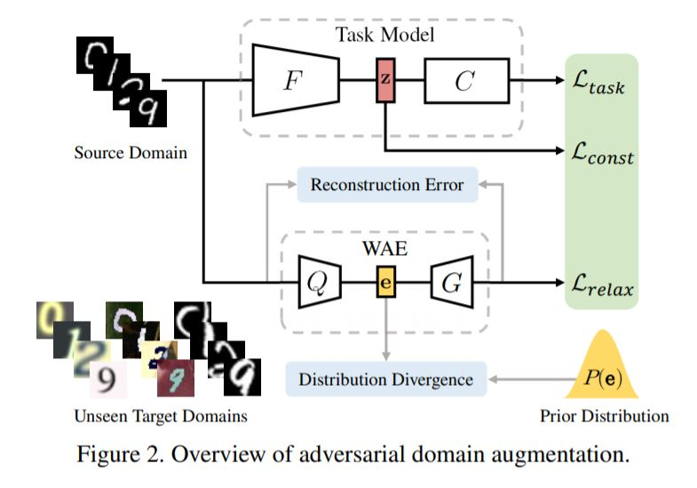

# Domain Adaptation

# Reveiw

# DFA
* Discriminative Feature Alignment:mproving Transferability of Unsupervised Domain Adaptation by Gaussian-guided Latent Alignment

# Network

# Related Work
* Maximum Classifier Discrepancy for Unsupervised Domain Adaptation
* CVPR 2018

# Step A
* Train Genrator and Classifiers

# Step B

# Step C

# Algorithm

# Performance

# JoCoR 
* Combating Noisy Labels by Agreement:
A Joint Training Method with Co-Regularization

# Algorithm

# [ADA](https://arxiv.org/pdf/2003.13216.pdf)
* Learning to Learn Single Domain Generalization

#
$$x^+_{t+1} \rightarrow x^+_t +\gamma \Delta x^+_t LADA(θ, ψ; x^+_t, z^+_t)$$
$$L_{ADA}=L_{task}(\theta;\bf{x})-\alpha L_{const}(\theta;\bf{z})+ \beta L_{relax}(\psi;\bf{x})$$

#
$$L_{task}(y,\hat{y})=- \sum_i y_i log\hat{y}_i$$

$$L_{const}=\frac{1}{2}|z-z^+|_2^2 +\infty. \textbf{1} \{ y \neq y^+ \}$$

$$\min_\si [|G(Q(\bf{x})) − x|^2 + \lambda D_e(Q(\bf{x}), P(\bf{e}))]$$

$$L_{relax}=| x^+ - V(x^+) |^2$$

# Relax

# عنوان اول {dir=rtl}

این متن فارسی باید راست به چپ نشان داده شود.

<!--stackedit_data:
eyJoaXN0b3J5IjpbMjEwNTg0OTkwNV19
-->
